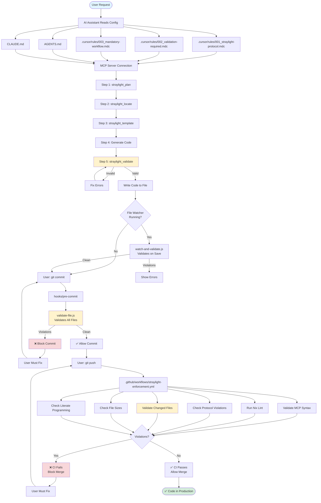
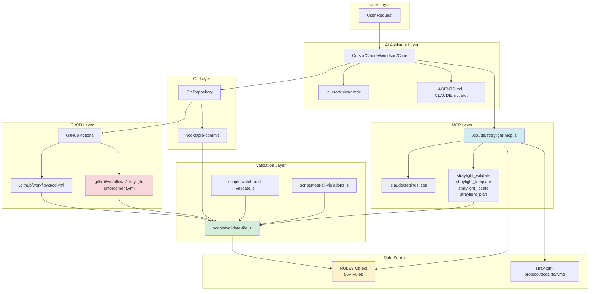
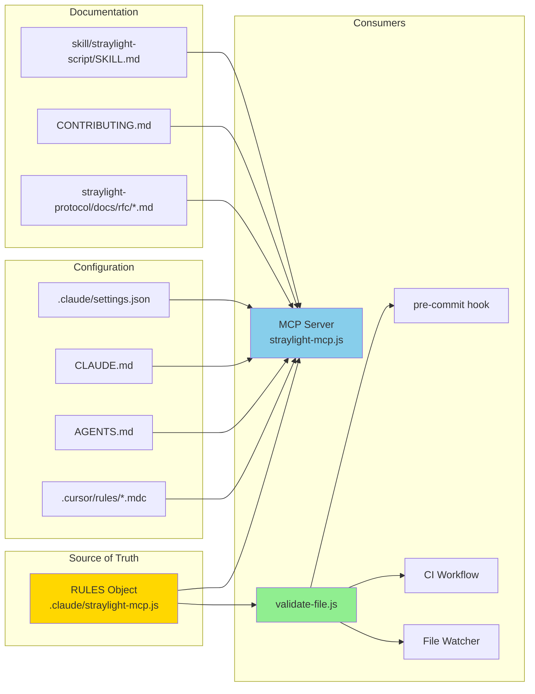
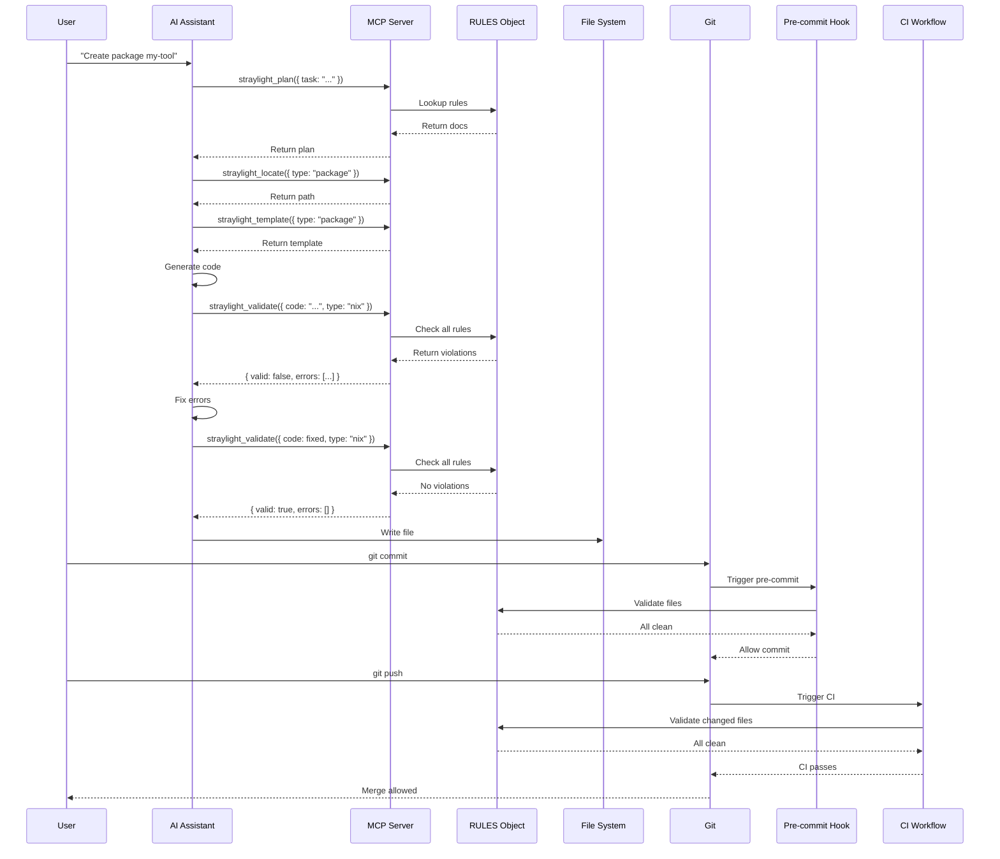

# Straylight Protocol Enforcement Flowchart

**Visual representation of the complete enforcement flow**

## Main Flowchart (Mermaid)



## Detailed Validation Flow

```mermaid
flowchart LR
    Code[Generated Code] --> Validate{straylight_validate}
    
    Validate --> CheckSize{File Size<br/>>500 lines?}
    CheckSize -->|Yes| SizeErr[❌ STRAYLIGHT-010 Error]
    CheckSize -->|No| CheckForbidden{Forbidden<br/>Rules}
    
    CheckForbidden --> Forbidden1[WSN-E001: with lib;]
    CheckForbidden --> Forbidden2[WSN-E002: rec in derivation]
    CheckForbidden --> Forbidden3[WSN-E003: camelCase]
    CheckForbidden --> Forbidden4[WSN-E004: Missing _class]
    CheckForbidden --> Forbidden5[WSN-E005: IFD]
    CheckForbidden --> Forbidden6[WSN-E006: Heredocs]
    CheckForbidden --> Forbidden7[WSN-E007: nixpkgs.config]
    CheckForbidden --> Forbidden8[WSN-E008: Missing meta]
    CheckForbidden --> Forbidden9[WSN-E009: Missing description]
    CheckForbidden --> Forbidden10[WSN-E010: Missing mainProgram]
    CheckForbidden --> Forbidden11[STRAYLIGHT-004: Missing import]
    CheckForbidden --> Forbidden12[STRAYLIGHT-011: Literate violations]
    
    Forbidden1 --> CheckRequired{Required<br/>Rules}
    Forbidden2 --> CheckRequired
    Forbidden3 --> CheckRequired
    Forbidden4 --> CheckRequired
    Forbidden5 --> CheckRequired
    Forbidden6 --> CheckRequired
    Forbidden7 --> CheckRequired
    Forbidden8 --> CheckRequired
    Forbidden9 --> CheckRequired
    Forbidden10 --> CheckRequired
    Forbidden11 --> CheckRequired
    Forbidden12 --> CheckRequired
    
    CheckRequired --> Required1[STRAYLIGHT-004: Script imports]
    CheckRequired --> Required2[WSN-E004: Module _class]
    
    Required1 --> CheckWarnings{Warning<br/>Rules}
    Required2 --> CheckWarnings
    
    CheckWarnings --> Warning1[WSN-W001: Long lines]
    CheckWarnings --> Warning2[WSN-W002: Missing description]
    CheckWarnings --> Warning3[WSN-W003: Long strings]
    CheckWarnings --> Warning4[WSN-W004: Missing meta]
    CheckWarnings --> Warning5[WSN-W005: Missing description]
    CheckWarnings --> Warning6[WSN-W006: Missing license]
    CheckWarnings --> Warning7[WSN-W007: Missing mainProgram]
    
    Warning1 --> Result{Any Errors?}
    Warning2 --> Result
    Warning3 --> Result
    Warning4 --> Result
    Warning5 --> Result
    Warning6 --> Result
    Warning7 --> Result
    SizeErr --> Result
    
    Result -->|Yes| ReturnErr[Return: valid=false<br/>errors=[...]]
    Result -->|No| ReturnOk[Return: valid=true<br/>errors=[]]
    
    style Validate fill:#fff3cd
    style Result fill:#d4edda
    style ReturnErr fill:#f8d7da
    style ReturnOk fill:#d4edda
```

## Component Interaction Diagram



## Scope Graph: Dependencies



## Enforcement Points Timeline

```mermaid
gantt
    title Straylight Protocol Enforcement Timeline
    dateFormat X
    axisFormat %s
    
    section AI Generation
    Read Rules           :0, 1
    Call straylight_plan      :1, 1
    Call straylight_locate    :2, 1
    Call straylight_template  :3, 1
    Generate Code        :4, 2
    Validate (MCP)       :6, 2
    Fix Errors           :8, 2
    Write File           :10, 1
    
    section File System
    File Saved           :11, 1
    Watcher Validates    :11, 1
    
    section Git Operations
    git add              :12, 1
    git commit           :13, 1
    Pre-commit Hook      :13, 1
    Commit Allowed       :14, 1
    git push             :15, 1
    
    section CI/CD
    CI Triggered         :16, 1
    CI Validation        :16, 3
    CI Passes            :19, 1
    Merge Allowed        :20, 1
```

## Rule Application Sequence



## Simplified Quick Reference

```
┌─────────────────────────────────────────────────────────────┐
│              STRAYLIGHT PROTOCOL ENFORCEMENT FLOW                 │
└─────────────────────────────────────────────────────────────┘

USER REQUEST
    │
    ▼
AI ASSISTANT
    ├─→ Reads: Rules, Configs, AGENTS.md
    ├─→ Calls: MCP Tools (plan, locate, template)
    ├─→ Generates: Code
    └─→ Validates: straylight_validate (MCP tool)
         │
         ├─→ ❌ Violations → Fix → Re-validate
         │
         └─→ ✅ Valid → Write File
              │
              ▼
FILE SAVED
    │
    ├─→ Optional: File Watcher validates
    │
    └─→ Git Commit
         │
         └─→ Pre-commit Hook validates
              │
              ├─→ ❌ Violations → Block commit
              │
              └─→ ✅ Clean → Allow commit
                   │
                   └─→ Git Push
                        │
                        └─→ CI Workflow validates
                             │
                             ├─→ ❌ Violations → Block merge
                             │
                             └─→ ✅ Clean → Allow merge
                                  │
                                  └─→ ✅ PRODUCTION

ENFORCEMENT POINTS:
1. AI Generation (MCP validation) - 100% coverage
2. File Save (Watcher) - Optional
3. Git Commit (Pre-commit hook) - 100% coverage
4. Git Push (CI workflow) - 100% coverage

RULE SOURCE:
Single source of truth: RULES object in .claude/straylight-mcp.js
All validators use same rules (synchronized)
```
