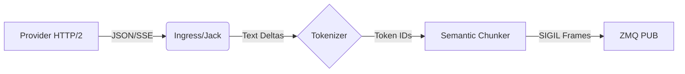

# Jaylene Slide Specification

**Version**: 0.2.0 (Draft)
**Date**: 2026-02-09
**Status**: Active

## 1. Overview

**jaylene-slide** is a high-performance ingress adapter for Large Language Model (LLM) inference. It bridges the gap between the chaotic, high-overhead world of HTTP/JSON inference APIs (OpenAI, Vertex AI, etc.) and the clean, low-latency world of the **SIGIL** binary wire protocol.

Its primary function is to "jack in" to an inference provider, parse their streaming output (typically Server-Sent Events), applying semantic chunking, and re-emit the stream as dense binary frames over ZeroMQ.

## 2. Architecture

The system is composed of three main stages: **Ingress**, **Processing**, and **Egress**.



### 2.1 Ingress (Jack)
The `Jack` module handles the connection to the inference provider.
- **Protocol**: HTTP/2 (multiplexed) or HTTP/1.1 (legacy).
- **Format**: OpenAI-compatible Server-Sent Events (SSE).
- **Auth**: Bearer Token or API Key.
- **Providers**:
  - **OpenAI Standard**: Groq, Together, Fireworks, vLLM.
  - **Google Vertex AI**: Requires `gemini-*-preview` models and specific region endpoints.
  - **Google AI Studio**: Uses `generativelanguage.googleapis.com`.

### 2.2 Processing
#### Tokenization
Incoming text deltas are converted to Token IDs to enable efficient SIGIL encoding.
- **FFI Mode**: Uses `tokenizers-cpp` to load HuggingFace `tokenizer.json` files. Used when the client expects a specific model's vocabulary (e.g., Qwen 2.5, Llama 3).
- **Identity Mode** (`--tokenizer identity`): Treats UTF-8 bytes as Token IDs (0-255). Allows transparent "text-in/text-out" streaming without proprietary tokenizer files.

#### Semantic Chunking
The `Chunk` module buffers tokens and emits frames only at semantic boundaries to reduce client jitter and bandwidth.
- **Boundaries**: Newlines, sentence endings, code fences.
- **Special States**:
  - **Thinking**: Detected via configurable delimiters (e.g., `<think>`). Emits `OP_THINK_START/END`.
  - **Tool Calls**: Detected via delimiters (e.g., `<tool_call>`). Emits `OP_TOOL_CALL_START/END`.
  - **Code Blocks**: Detected via ` ``` `. Emits `OP_CODE_BLOCK_START/END`.

### 2.3 Egress
- **Protocol**: ZeroMQ (ZMQ) PUB pattern.
- **Format**: SIGIL (See Section 3).
- **Port**: Default `tcp://*:5555`.

## 3. SIGIL Wire Format

SIGIL is a distribution-derived binary encoding designed for streaming token generation.

### 3.1 Token Encoding
- **Hot Tokens (1 Byte)**: IDs `0x00` - `0x7E` (0-126). These are the 127 most frequent tokens in the stream.
- **Extended Tokens (Varint)**: `0x80` + LEB128-encoded Token ID. Used for all other tokens.

### 3.2 Control Frames
Control opcodes occupy the `0xC0` - `0xCF` range.

| Opcode | Name | Description |
| :--- | :--- | :--- |
| `0xC0` | `CHUNK_END` | Marks the end of a semantic chunk (flush to screen). |
| `0xC1` | `TOOL_CALL_START` | Enters tool calling mode. |
| `0xC2` | `TOOL_CALL_END` | Exits tool calling mode. |
| `0xC3` | `THINK_START` | Enters reasoning/thinking mode. |
| `0xC4` | `THINK_END` | Exits reasoning/thinking mode. |
| `0xC5` | `CODE_BLOCK_START`| Enters code block mode. |
| `0xC6` | `CODE_BLOCK_END` | Exits code block mode. |
| `0xCF` | `STREAM_END` | Signals the end of the generation. |
| `0xF0` | `ENVELOPE_START` | Starts a signed envelope (Public Key + Signature). |

## 4. Configuration

Configuration is managed via **Dhall** profiles.

### 4.1 Schema
The configuration defines the Provider connection and the Model characteristics.

#### Legacy Adapter Mode
To support existing models without native SIGIL grammars, `jaylene-slide` uses a `Delimiters` record to reverse-engineer semantic boundaries from the token stream. This is a transitional "Legacy Adapter" mechanism.

```dhall
-- schemas/sigil/Model.dhall
let Delimiters =
  { think_start : Optional Text
  , think_end : Optional Text
  , tool_start : Optional Text
  , tool_end : Optional Text
  , code_fence : Text
  }
```

### 4.2 Profiles
Profiles allow rapid switching between different provider/model combinations.

- **Vertex AI** (`profiles/vertex-gemini.dhall`): Configured for `gemini-3-pro-preview` on Google Cloud.
- **Google AI Studio** (`profiles/gemini-studio.dhall`): Configured for API Key access to `gemini-2.0-flash`.
- **Groq** (`profiles/groq-llama3.dhall`): Configured for Llama 3 on Groq.

## 5. Implementation Details

### 5.1 Identity Tokenizer
To support closed models or avoid tokenizer distribution issues, the **Identity Tokenizer** treats the stream as raw bytes.
- **Vocab Size**: 256.
- **Mapping**: Byte `0x61` ('a') -> Token ID `97`.
- **Chunking**: Delimiters are matched against the byte sequence.

### 5.2 Hot Table
The `HotTable` maps the 127 most frequent Token IDs (for a specific model) to the 1-byte range `0x00-0x7E`.
- **Default**: Identity mapping (0->0, 1->1).
- **Optimized**: A pre-computed table can be loaded (`--hot-table`) to maximize compression for specific languages or domains.

## 6. Commands

### Jack (Ingress)
Connects to a provider and publishes frames.

```bash
nix run .#slide -- jack \
  --config profiles/vertex-gemini.dhall \
  --verbose
```

### Listen (Client)
Subscribes to ZMQ and prints decoded text.

```bash
nix run .#slide -- listen \
  --tokenizer identity \
  --show-think
```
