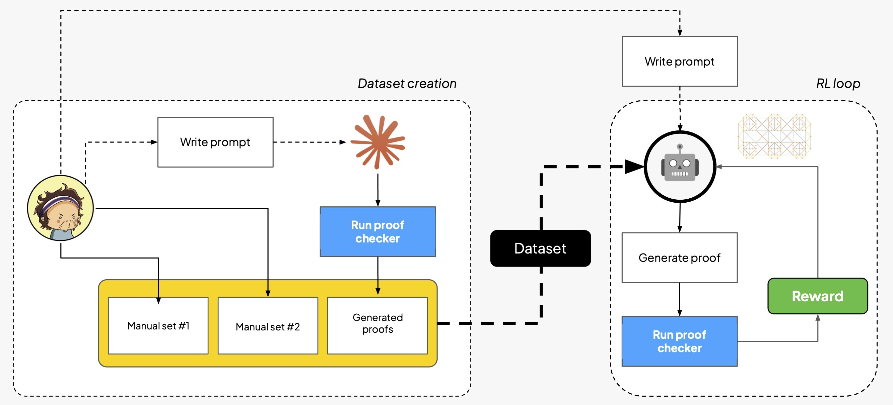

# Understanding Vibe Proving: build your own LLM + verifier stack

Playground for the TDS series on LLMs and proofs: train your own LLMs to generate formally verifiable proofs, i.e. ["vibe proving"](https://x.com/vladtenev/status/1994922827208663383?s=20).

## Overview

This repository contains code and examples for building a proof checker and training a proof generator from scratch, as described in the TDS series on [LLMs](https://towardsdatascience.com/understanding-vibe-proving-part-1/) and [proofs](https://towardsdatascience.com/implementing-vibe-proving-with-rl/).



The diagram illustrates how all the main pieces of the project come together: 

- **Proof checker** (which we build first, see below) verifies the correctness of arbitrary proofs in our "reasoning language", whether human-written or LLM-generated;
- **Dataset creation** (left), where manually curated and LLM-generated proofs (first validated by the proof checker, in blue) are combined into a training dataset for reinforcement learning;
- **RL loop** (right), where a model learns to generate proofs by receiving binary reward from the proof checker.

Read the blog posts for background info, context and detailed explanation on the workflow:

* [Part 1](https://towardsdatascience.com/understanding-vibe-proving-part-1/): Understanding Vibe Proving
* [Part 2](https://towardsdatascience.com/implementing-vibe-proving-with-rl/): Implementing Vibe Proving with Reinforcement Learning

Acknowledgements: the code in this repository has been generated with the help of Claude Code ("Resistance is futile"). Personally, this repo is the first real attempt I made at using LLMs to write the majority of the code as a first stab, and then intervening by cleaning things up, simplifying, and mostly adding / refining tests to build confidence in the overall correctness of the implementation.

## Setup

### Python environment

We use [uv](https://docs.astral.sh/uv/) for dependency management. To get started with the project, install uv and then run:

```bash
uv sync
```

### API keys (only for Part 2)

Copy the template environment file and fill in your API keys:

```bash
cp src/local.env src/.env
```

Then edit `src/.env` with your keys:
- `ANTHROPIC_API_KEY`: Your Anthropic API key (for generating the training set)
- `TINKER_API_KEY`: Your Tinker API key (for running the training job)

## Part 1. Proof Checker

### Proof syntax

The file `proof_rules_and_style.md` contains the style conventions (by rule) used in this project. A proof is a sequence of numbered lines with the following structure:

```
1. A and B
2. C
_
3. | not A
4. | A (1)
5. | ~ (3,4)
__
6. A (5)
7. A and C (6,2)
```

Key elements:

- **Formulas** use Python boolean syntax: `and`, `or`, `not`, with uppercase variables (`A`, `B`, `C`, etc.) and parentheses for grouping, e.g., `(A and B) or C`
- **`~`** represents contradiction (always false)
- **`_`** separates premises (above) from derived lines (below)
- **Line references** in parentheses justify each derived step, e.g., `(1,2)` means "follows from lines 1 and 2"
- **Subproofs** are indented with `|` (one per nesting level), used for indirect proof and or-elimination
- **`__`** explicitly closes a subproof

### How to check a proof

A few examples of how to use the proof checker can be found in `src/proof_checker_playground.py`, demonstrating both valid and invalid proofs, including error handling for poorly formatted proofs.

```bash
cd src
uv run python proof_checker_playground.py
```

Note that we showcase only a few simple proofs, mostly to highlight how the proof checker class works. We refer the reader to the tests for a more comprehensive set of examples.

### Run the tests

To run the full test suite for the proof checker:

```bash
cd src
uv run pytest tests/ -v
```

## Part 2. Training a Proof Generator

### Generating the training set

The training set is generated by prompting a powerful, closed-source LLM to produce valid propositional logic proofs, which are then verified using the proof checker (so that we know the problems are solvable in the first place). Only the premises and conclusions are kept in the final dataset (as the model is expected to generate the proofs).

```bash
cd src
uv run python generate_training_set.py --model claude-sonnet-4-20250514 --n 30 --batches 5 --output training_data.jsonl
```

For all the available options, check the `generate_training_set.py` script.

### Running the training job

The training uses reinforcement learning (via [Tinker](https://tinker-docs.thinkingmachines.ai/)) to fine-tune an LLM to generate valid proofs. The proof checker provides binary reward: 1.0 for valid proofs, 0.0 for invalid ones. Make sure to first generate the training set: by default, the final training set is the union of `training_data.jsonl` and three manually curated files, `forallx.jsonl`, `lpl_1.jsonl`, and `lpl_2.jsonl`, corresponding to exercises in popular textbooks ([forallx](https://forallx.openlogicproject.org/) and [Language, Proof and Logic](https://www.amazon.com/Language-Proof-Logic-David-Barker-Plummer/dp/1575866323)).

```bash
cd src
uv run python training.py dataset_path=training_data.jsonl
```

You can inspect `class Config:` in `training.py` for all the available options.

### Training dashboard

To visualize training metrics and explore generated proofs, run the Streamlit dashboard:

```bash
cd src
uv run streamlit run training_dashboard.py
```

The dashboard allows you to:
- Select from multiple training jobs (each saved in `training_logs/<job_id>/`)
- View success rate and reward curves over training steps
- Browse generated proofs with filtering by validity status

## Where to go from here?

While we did our best to build a correct proof checker and a working training pipeline, there are many possible improvements and extensions to explore:

- Stress test the proof checker: we wrote tests, we inspected some samples manually, but it is definitely possible some subtle (and not-so-subtle) bugs remain. Interestingly enough, since RL models are very good at exploiting loopholes to get high reward, a bug may be identified by checking non-trivial proofs generated by the model that are incorrectly marked as valid.
- Improve the training set generation: e.g., by adding more diverse problems, or doing more literature work and finding existing datasets of interesting proofs and exercises.
- Improve the RL training: e.g., by tinkering with hyperparameters, evaluating more models, and trying curriculum learning or other, more advanced, techniques.
- Finally, you can graduate to a more realistic setup, and move from our custom syntax to a purpose-built programming language, such as [Lean](https://leanprover.github.io/).

## License
The code is provided "as is" without warranty of any kind, following the MIT license (it is indeed a weekend project). See the LICENSE file for details.
