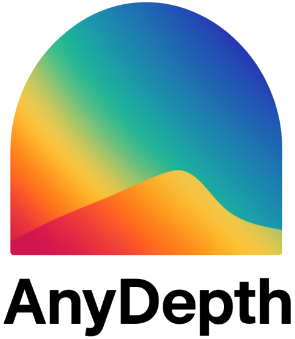
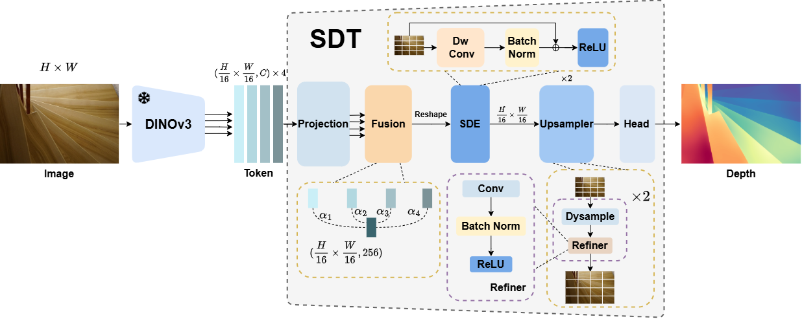
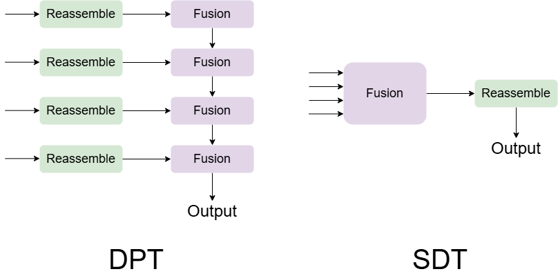

#  AnyDepth: Depth Estimation Made Easy

> *"Simplicity is prerequisite for reliability." --- Edsger W. Dijkstra*


> **AnyDepth: Depth Estimation Made Easy**
>
> Zeyu Ren<sup>1*</sup>, [Zeyu Zhang](https://steve-zeyu-zhang.github.io/)<sup>2*†</sup>, Wukai Li<sup>2</sup>, Qingxiang Liu<sup>3</sup>, Hao Tang<sup>2‡</sup>
>
> <sup>1</sup>The University of Melbourne, <sup>2</sup>Peking University, <sup>3</sup>Shanghai University of Engineering Science
>
> <sup>*</sup>Equal contribution. <sup>†</sup>Project lead. <sup>‡</sup>Corresponding author.
>
> ### [Paper](https://arxiv.org/abs/2601.02760) | [Website](https://aigeeksgroup.github.io/AnyDepth) | [Model](https://huggingface.co/AIGeeksGroup/AnyDepth) | [HF Paper](https://huggingface.co/papers/2601.02760)

## ✏️ Citation

If you find our code or paper helpful, please consider starring ⭐ us and citing:

```bibtex
@article{ren2026anydepth,
  title={AnyDepth: Depth Estimation Made Easy},
  author={Ren, Zeyu and Zhang, Zeyu and Li, Wukai and Liu, Qingxiang and Tang, Hao},
  journal={arXiv preprint arXiv:2601.02760},
  year={2026}
}
```


## 🏃 Intro

We present **AnyDepth**, a simple and efficient training framework for zero-shot monocular depth estimation. The core contribution is the **Simple Depth Transformer (SDT)**, a compact decoder that achieves comparable accuracy to DPT while reducing parameters by **85%--89%**.

**Key Features:**
- **Single-Path Fusion**: Fuse-then-reassemble strategy avoids multi-branch cross-scale alignment
- **Weighted Fusion**: Learnable fusion of 4-layer ViT features with cls token readout
- **Spatial Detail Enhancer (SDE)**: Depthwise convolution for local spatial modeling
- **DySample Upsampling**: Two-stage learnable upsampling (H/16 -> H/4 -> H)
- **Lightweight**: Only ~5-13M parameters for the decoder



## ⚡ Quick Start

SDT has no additional dependencies beyond PyTorch. Simply replace DPT or other decoders with SDT in your existing codebase.

### Usage

```python
import torch
from sdt_head import SDTHead

# in_channels: ViT-S=384, ViT-B=768, ViT-L=1024
# extract layers: [2,5,8,11] for ViT-S/B, [4,11,17,23] for ViT-L
head = SDTHead(
    in_channels=in_channels,
    fusion_channels=fusion_channels,
    n_output_channels=1,
    use_cls_token=True
)
```

## 📦 Datasets

We provide the training splits (369K samples) in the `datasets/` folder. To prepare the data:

1. **Hypersim & Virtual KITTI**: Follow the instructions from [Lotus](https://github.com/EnVision-Research/Lotus) to download and prepare these datasets.

2. **IRS**: Follow the official instructions at [IRS](https://github.com/blackjack2015/IRS).

3. **BlendedMVS**: Follow the official instructions at [BlendedMVS](https://github.com/YoYo000/BlendedMVS).

4. **TartanAir**: Follow the official instructions at [TartanAir](https://github.com/castacks/tartanair_tools).

## 📊 SDT vs DPT



**Key Difference**: DPT uses a reassemble-fusion strategy (per-layer reassembly + cross-scale fusion), while SDT uses a fusion-reassemble strategy (fuse tokens first, then single-path upsampling).

### Decoder Parameters

| Decoder | ViT Backbone | Params (M) |
|---------|--------------|------------|
| DPT | ViT-S | 50.83 |
| DPT | ViT-B | 76.05 |
| DPT | ViT-L | 99.58 |
| **SDT** | ViT-S | **5.51** |
| **SDT** | ViT-B | **9.45** |
| **SDT** | ViT-L | **13.38** |

### Multi-Resolution Efficiency (ViT-L, H100 GPU)

| Resolution | Decoder | FLOPs (G) | Latency (ms) |
|------------|---------|-----------|--------------|
| 256×256 | DPT | 444.14 | 6.66 ± 0.22 |
| 256×256 | **SDT (Ours)** | **234.17** | **6.10 ± 0.33** |
| 512×512 | DPT | 1776.56 | 24.65 ± 0.22 |
| 512×512 | **SDT (Ours)** | **936.70** | **23.17 ± 0.54** |
| 1024×1024 | DPT | 7106.22 | 99.79 ± 0.79 |
| 1024×1024 | **SDT (Ours)** | **3746.79** | **93.09 ± 0.51** |

## 🧪 Zero-Shot Depth Estimation Results

### AnyDepth vs DPT (DINOv3 Encoder)

| Method | Data | Encoder | Params | NYUv2 | KITTI | ETH3D | ScanNet | DIODE |
|--------|------|---------|--------|-------|-------|-------|---------|-------|
| DPT | 584K | ViT-S | 71.8M | 8.4 | 10.8 | 12.7 | 8.3 | 26.0 |
| **AnyDepth** | 369K | ViT-S | 26.5M | 8.2 | 10.2 | 8.4 | 8.0 | 24.7 |
| DPT | 584K | ViT-B | 162.1M | 7.5 | 10.8 | 10.0 | 7.1 | 24.5 |
| **AnyDepth** | 369K | ViT-B | 95.5M | 7.2 | 9.7 | **8.0** | 6.8 | 23.6 |
| DPT | 584K | ViT-L | 399.6M | 6.1 | 8.9 | 13.0 | 6.0 | 23.4 |
| **AnyDepth** | 369K | ViT-L | 313.4M | **6.0** | **8.6** | 9.6 | **5.4** | **22.6** |

*Metric: AbsRel % (lower is better)*

### Zero-Shot Affine-Invariant Depth Estimation with Different Encoders and Decoders

We fine-tune on Hypersim and Virtual KITTI with depth foundation models (DAv2, DA3, VGGT).

| Method | Encoder | Decoder | NYUv2 | KITTI | ETH3D | ScanNet | DIODE |
|--------|---------|---------|-------|-------|-------|---------|-------|
| DAv2 | ViT-B | DPT | 5.8 | **10.4** | 8.8 | 6.2 | **23.4** |
| DAv2 | ViT-B | **SDT** | **5.6** | 10.7 | **7.5** | **6.1** | 23.9 |
| DA3 | ViT-L | DPT | **4.9** | **8.8** | 6.9 | 5.0 | 22.5 |
| DA3 | ViT-L | Dual-DPT | **4.9** | 8.9 | 7.0 | **4.9** | 22.3 |
| DA3 | ViT-L | **SDT** | **4.9** | 8.9 | **5.8** | 5.0 | **21.9** |
| VGGT | VGGT-1B | DPT | **4.8** | 15.6 | 7.2 | **4.6** | 30.7 |
| VGGT | VGGT-1B | **SDT** | **4.8** | **15.5** | **7.0** | **4.6** | **30.6** |

*Metric: AbsRel % (lower is better). The encoder used pre-trained weights, and the decoder was randomly initialized.*

## 🚀 Real-World Deployment

SDT has been tested on **Jetson Orin Nano (4GB)**:

| Resolution | Decoder | Latency (ms) | FPS |
|------------|---------|--------------|-----|
| 256×256 | DPT | 305.65 | 3.3 |
| 256×256 | **SDT (Ours)** | **213.35** | **4.7** |
| 512×512 | DPT | 1107.64 | 0.9 |
| 512×512 | **SDT (Ours)** | **831.48** | **1.2** |

## 😘 Acknowledgement

- [DINOv2](https://github.com/facebookresearch/dinov2) / [DINOv3](https://github.com/facebookresearch/dinov3)
- [Depth Anything V2](https://github.com/DepthAnything/Depth-Anything-V2)
- [Depth Anything 3](https://github.com/ByteDance-Seed/Depth-Anything-3)
- [VGGT](https://github.com/facebookresearch/vggt)
- [DySample](https://arxiv.org/abs/2308.15085)
- [DPT](https://github.com/isl-org/DPT)

## 📜 License

This work is licensed under [CC BY-NC-SA 4.0](https://creativecommons.org/licenses/by-nc-sa/4.0/).
