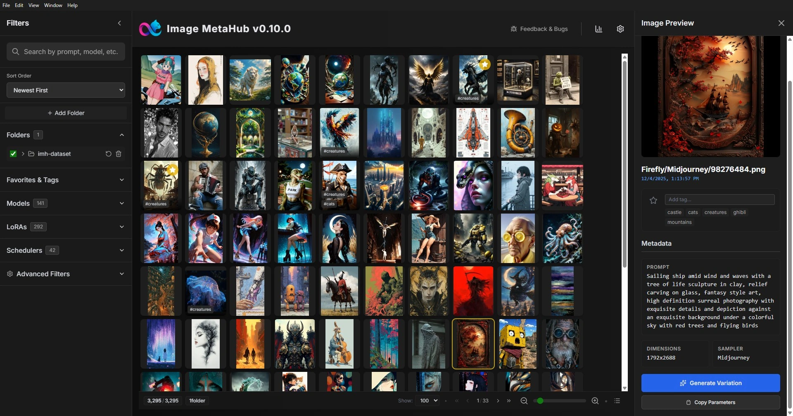
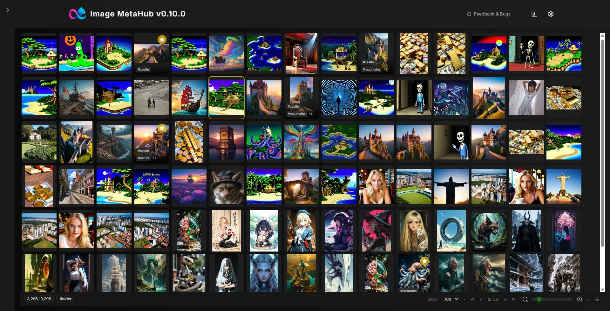
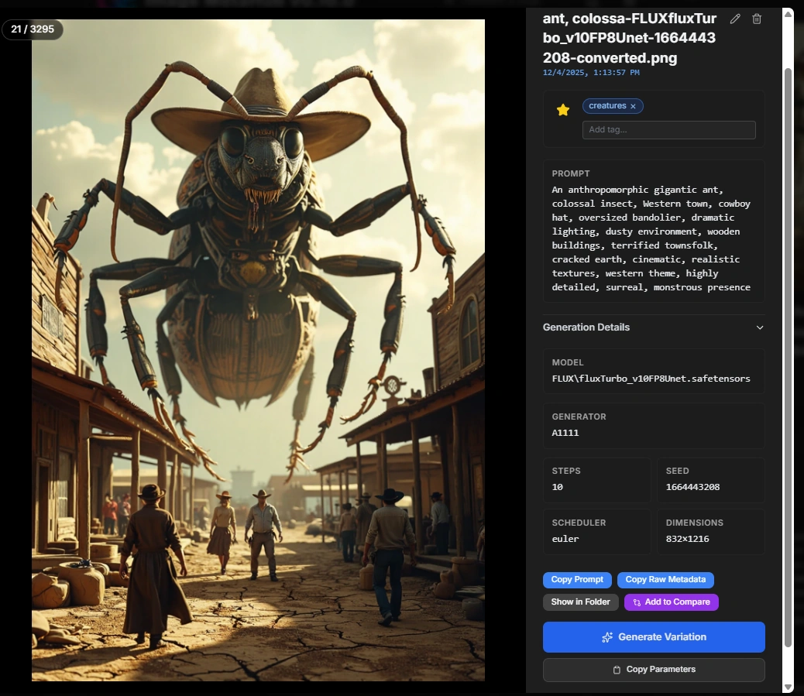
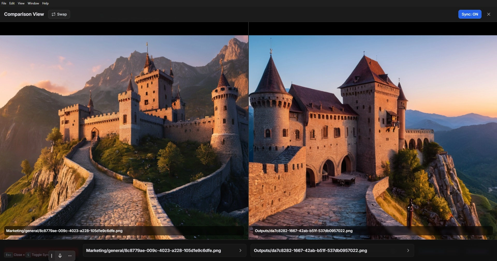
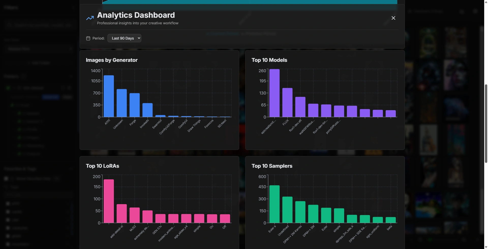

# Image MetaHub

[](https://lucasphere4660.gumroad.com/l/qmjima)
[](https://ko-fi.com/lucaspierri)

*Local AI image browser and metadata hub for AI images from Stable Diffusion and related tools.*



## What is Image MetaHub?

Image MetaHub is a **local image browser and manager** focused on AI-generated images.
It scans your folders, parses metadata from popular tools (Automatic1111, ComfyUI, Fooocus, SD.Next, Forge, SwarmUI, DrawThings) and online services like Midjourney / Nijijourney, whenever their metadata is present in the files, and lets you search, filter and organize your images by prompt, model, sampler, seed and more - all **offline**, on your machine.

It is open-source (MPL 2.0) and free to use, with optional **Pro features** for power users.

> *Previously known as **"Local Image Browser for InvokeAI"** - renamed as the project grew beyond a single backend into a broader AI image hub.*

---

## Key features (overview)

* **Fast local browser** for AI images (no accounts, no cloud, no telemetry)
* **Rich metadata parsing** for Stable Diffusion / A1111 / ComfyUI and other tools, including WebP format
* **Auto-Watch functionality** for real-time monitoring of output folders during generation
* **Powerful search & filters** by prompt text, model, steps, CFG, sampler, seed, etc.
* **Smart Library** with clustering stacks and collections
* **Auto-tags and manual tags** for faster organization and discovery
* **Deduplication helper (Experimental)** to pick the best images in a stack
* **Compare tools** with diff view to inspect variations side-by-side (Pro)
* **Analytics dashboard** with performance metrics and verified telemetry badges (Pro)
* **Automatic1111 integration** with model/LoRA selection and image size controls (Pro)
* **ComfyUI integration** with full workflow-based generation and real-time progress tracking (Pro)
* **Unified generation queue** for tracking both A1111 and ComfyUI jobs in one place (Pro)

Below sections go into more detail - but if you just want to try it, jump to **Getting started**.

---

## Free vs Pro

Image MetaHub is developed as a hybrid model:

* The **core app is free and open-source (MPL 2.0)** - this repository.
* Some **advanced workflow features are Pro** and require a license key to unlock in the desktop app.

**Free (core) includes for example:**

* Scanning folders and caching metadata
* Browsing, searching and filtering images
* Smart Library clustering stacks and collections
* Auto-tags suggestions and manual tag workflows
* Deduplication helper (beta) for stack cleanup

**Pro currently unlocks:**

* Automatic1111 integration with model/LoRA selection and image size controls
* ComfyUI integration with full workflow-based generation and real-time progress
* Unified generation queue for tracking both A1111 and ComfyUI jobs
* Compare panel with intelligent diff view for variations
* Analytics dashboard with performance metrics and verified telemetry

The goal is to keep the core tool open and useful for everyone, while making heavy-duty workflow features help sustain the project.

---

## Getting started

1. **Download the latest release**

   * Go to the [Releases](https://github.com/LuqP2/Image-MetaHub/releases) page and grab the installer for your platform (Windows / Linux / macOS).

2. **Install and run**

   * Launch Image MetaHub.

3. **Add your image folders**

   * Point the app to the directories where you keep your AI-generated images.
   * Image MetaHub will scan and index them, reading metadata where available.

4. **Start browsing & filtering**

   * Use the search bar and filters (model, sampler, steps, seed, etc.) to narrow down results.



For more detailed options (CLI, dev setup, advanced config), see the sections below.

---

## Auto-Watch: Real-time folder monitoring

Image MetaHub can automatically monitor your output folders and detect new images in real-time as they're generated:

* **Individual folder toggles** - Enable/disable watching per directory with eye icon
* **Real-time detection** - Instant image detection using intelligent file monitoring
* **Background processing** - Silent updates without notifications or interruptions
* **State persistence** - Watchers automatically restored on app restart
* **Multiple formats** - Supports PNG, JPG, JPEG, and WEBP
* **Smart filtering** - Automatically filters cache folders and system directories

Perfect for monitoring ComfyUI or Automatic1111 output folders during active generation sessions.

---

## Smart Library: Clustering, auto-tags, and dedup (beta)

The Smart Library groups similar images into stacks using prompt similarity, so you can browse variations together and manage large libraries faster.

* **Clustering stacks** - Background worker builds stacks from prompt similarity with progress updates and cached results
* **Collections sidebar** - Filter stacks by model and auto-tag collections
* **Auto-tags** - TF-IDF suggestions from prompts and metadata, with promote-to-tag and removal workflows
* **Dedup helper (beta)** - Suggests best vs archived images in a stack and estimates disk space savings

---

## Metadata support

Image MetaHub parses metadata from:

* Stable Diffusion / Automatic1111 images (PNG, JPEG, WebP)
* ComfyUI (**full coverage** with [MetaHub Save Node](https://github.com/LuqP2/ImageMetaHub-ComfyUI-Save) - [ComfyUI Registry](https://registry.comfy.org/publishers/image-metahub/nodes/imagemetahub-comfyui-save); partial coverage for legacy workflows)
* Fooocus
* SD.Next
* Forge
* SwarmUI
* DrawThings
* Online services like Midjourney / Nijijourney (when prompts/settings are saved into the downloaded files)
* Other tools that store generation parameters in PNG/JPG/WebP metadata

> **New in v0.12.0 - Smart Library + Auto-Tags:** Image MetaHub can now cluster similar prompts into stacks, generate TF-IDF auto-tags, and surface dedup suggestions for large libraries.
>
> **NEW in v0.11.0 - Official MetaHub Save Node for ComfyUI:** We've released an [official companion custom node](https://github.com/LuqP2/ImageMetaHub-ComfyUI-Save) ([ComfyUI Registry](https://registry.comfy.org/publishers/image-metahub/nodes/imagemetahub-comfyui-save)) designed specifically for Image MetaHub. This node guarantees full metadata compatibility by auto-extracting all generation parameters and saving them in both A1111 and Image MetaHub formats.
>
> For legacy ComfyUI images without MetaHub Save Node, Image MetaHub attempts to parse metadata from standard workflow formats, though coverage may vary depending on custom nodes and workflow complexity.

### Enhanced MetaHub Save Node Integration

When using the MetaHub Save Node, Image MetaHub automatically provides:

* **Auto-import tags** - Tags from `imh_pro.user_tags` are automatically imported for filtering
* **Notes display** - Notes from `imh_pro.notes` shown as read-only metadata
* **Performance metrics** - GPU analytics including VRAM usage, generation time, steps/second, and system versions
* **Verified telemetry badges** - Visual badges and filters for images with verified performance data
* **LoRA weights** - Complete LoRA information with weights (e.g., "style_lora_v1.safetensors (0.8)")

If a tool writes prompt / settings in a consistent way, Image MetaHub can usually read it. The parsers are extensible and can be updated as new formats appear.



---

## Automatic1111 integration (Pro)

With Pro enabled, Image MetaHub can talk directly to a running Automatic1111 instance with full-featured generation controls:

* **Model and LoRA selection** - Browse and select from your installed models and LoRAs with search filters
* **Image size controls** - Set custom width and height for generation
* **Smart model memory** - "Remember last selected model" automatically selects your previously used model
* **Full parameter control** - Adjust prompts, negative prompts, CFG scale, steps, and seed
* **Real-time progress** - Live generation tracking with step-by-step progress updates

Basic setup:

1. Enable the API flag in your A1111 setup (`--api`).
2. Configure the A1111 endpoint in Image MetaHub settings.
3. Use "Generate with A1111" from image details / context menus.

For step-by-step instructions, see the dedicated docs in this repo.

---

## ComfyUI integration (Pro)

With Pro enabled, Image MetaHub can generate variations of your images by sending workflows directly to your ComfyUI instance via API with complete workflow-based generation.

**Requirements:**

* ComfyUI running locally (default: `http://127.0.0.1:8188`)
* [MetaHub Save Node](https://github.com/LuqP2/ImageMetaHub-ComfyUI-Save) installed in ComfyUI - [Get it on ComfyUI Registry](https://registry.comfy.org/publishers/image-metahub/nodes/imagemetahub-comfyui-save)
  * Official companion node released with v0.11.0
  * Ensures full metadata preservation for generated images
* [MetaHub Timer Node](https://github.com/LuqP2/ImageMetaHub-ComfyUI-Save) (included with Save Node, for accurate timing metrics)

**How It Works:**

1. Select any image in Image MetaHub with generation metadata
2. Click "Generate with ComfyUI" from the image details panel
3. Customize generation parameters (prompt, seed, steps, CFG, etc.)
4. Image MetaHub creates a simple txt2img workflow from the metadata
5. Workflow is sent to ComfyUI via `POST /prompt` API
6. **Real-time WebSocket-based progress tracking** during generation
7. Generated images are automatically saved by MetaHub Save Node with full metadata

**Key Features:**

* **Full parameter customization** - Model, LoRAs, seed, steps, CFG, image size
* **Real-time progress tracking** - Live WebSocket updates during generation
* **Copy workflow JSON** - Export workflow to clipboard for manual tweaking
* **Unified generation queue** - Track both A1111 and ComfyUI jobs in one sidebar
* **Queue management** - Cancel, retry, remove items, clear finished/all jobs
* **Automatic metadata preservation** - MetaHub Save Node ensures all generation data is saved

**Important: The workflow doesn't need to match your original workflow.**

Image MetaHub creates a **basic txt2img workflow** from the extracted metadata. This means:

**Preserved Parameters:**
- Positive and negative prompts
- Model name (checkpoint)
- Seed, steps, CFG scale
- Sampler and scheduler
- Image dimensions (width/height)

**Not Preserved (Advanced Features):**
- ControlNet inputs and preprocessing
- Upscalers and high-res fixes
- Refiner models and switch points
- Custom node configurations
- Multi-stage workflows
- Advanced LoRA configurations beyond basic weights

**Generated Workflow Structure:**

The generated workflow is a simple linear pipeline:
```
CheckpointLoader -> MetaHub Timer -> CLIPTextEncode (positive/negative)
                                    |
EmptyLatent -> KSampler -> VAEDecode -> MetaHub Save Node
```

The **MetaHub Timer** node is automatically included to ensure accurate `generation_time_ms` and `steps_per_second` metrics in your variation images.

**Why This Approach?**

This simplified workflow approach ensures:
- Reliable generation from any source image (A1111, ComfyUI, Fooocus, etc.)
- Consistent parameter extraction across different formats
- Compatibility across different ComfyUI setups and versions
- Fast workflow execution with minimal overhead
- No dependency on complex custom nodes

**Setup:**

1. Enable ComfyUI API (enabled by default, runs on port 8188)
2. Install MetaHub Save Node in ComfyUI:

   **Via ComfyUI Manager (Recommended):**
   - Search for "ImageMetaHub Save Node" in ComfyUI Manager
   - Or visit [ComfyUI Registry](https://registry.comfy.org/publishers/image-metahub/nodes/imagemetahub-comfyui-save)

   **Manual Installation:**
   ```bash
   cd ComfyUI/custom_nodes
   git clone https://github.com/LuqP2/ImageMetaHub-ComfyUI-Save.git
   cd ImageMetaHub-ComfyUI-Save
   pip install -r requirements.txt
   ```
3. Configure ComfyUI endpoint in Image MetaHub settings
4. Test connection and start generating variations

**Use Cases:**

* **Quick variations** - Modify prompts and regenerate with different seeds
* **Parameter testing** - Experiment with different CFG scales, steps, samplers
* **Seed exploration** - Generate multiple variations of a composition you like
* **Model comparison** - Use the same prompt with different checkpoints

**Recommendations:**

* Use "Generate with ComfyUI" for creating quick variations with modified prompts/seeds
* For advanced workflows (ControlNet, upscaling, multi-stage), manually load your full workflow in ComfyUI and adjust parameters there
* The generated workflow serves as a starting point that you can enhance in ComfyUI with additional nodes

---

## Compare panel (Pro)

The compare panel lets you:

* Pin multiple images and inspect them side-by-side
* Use synchronized zoom and pan to align details across images
* View prompts and key generation settings for each image at the same time
* **Toggle between Standard and Diff views** - Intelligent difference highlighting with word-level diff for prompts
* **Smart field comparison** - Automatically detects differences in models, LoRAs, seeds, CFG, steps, sampler, and clip skip
* **Neutral visual design** - Subtle highlighting for differences without intrusive badges
* Study subtle differences between variations (lighting, composition, models, seeds, etc.)



---

## Analytics dashboard (Pro)

The analytics dashboard gives you a high-level view of your generation patterns and performance metrics:

**Generation Insights:**

* Most used models / samplers
* Resolution / aspect ratio distributions
* Trends over time

**Performance Analytics Dashboard:**

For images with [MetaHub Save Node](https://github.com/LuqP2/ImageMetaHub-ComfyUI-Save) telemetry data, the dashboard provides comprehensive performance visualizations:

* **Overview Cards:**
  * Average generation speed (it/s)
  * Average VRAM usage (GB with percentage for known GPUs)
  * Average generation time
  * Telemetry coverage percentage across your library

* **Generation Time Distribution:**
  * Histogram showing the distribution of generation times across time buckets
  * Buckets: < 1s, 1-5s, 5-10s, 10-30s, 30s-1m, 1-2m, > 2m
  * Helps identify performance patterns and outliers

* **Performance by GPU Device:**
  * Dual-axis bar chart comparing average speed (it/s) and VRAM usage (GB)
  * Side-by-side comparison across different GPU devices
  * Automatic GPU model detection (RTX 4090, 3090, 3080, A100, etc.)

* **Performance Over Time:**
  * Timeline chart tracking generation speed and VRAM trends
  * Group by day, week, or month
  * Dual-axis visualization for speed and memory usage patterns

* **MetaHub Save Node Promotion:**
  * Dismissible top banner with links to [ComfyUI Registry](https://registry.comfy.org/publishers/image-metahub/nodes/imagemetahub-comfyui-save) and [GitHub](https://github.com/LuqP2/ImageMetaHub-ComfyUI-Save)
  * Subtle footer reminder for users without telemetry data
  * localStorage-based banner dismissal preference

**System Insights:**

* GPU device information
* ComfyUI version, PyTorch version, Python version
* **Verified telemetry badges** - Visual indicators and filters for images with complete performance data

The dashboard helps you understand your generation patterns, track performance across different hardware, and identify optimization opportunities based on real telemetry data.



---

## Development

This repo contains the full source code for the core app.

* **Tech stack:** Electron, React, TypeScript, Vite
* **License:** MPL 2.0

Basic dev commands:

```bash
# install dependencies
npm install

# run in dev mode
npm run dev:app

# build production bundle
npm run build

# build desktop app (no publish)
npm run electron-dist
```

If you're interested in contributing (bugfixes, parser support, UX tweaks, etc.), feel free to open an issue or PR.

---

## Privacy

Image MetaHub is designed to be **local-first**:

* Your libraries and metadata stay on your machine.
* No mandatory account, no remote server dependency.
* Network calls are limited to features that explicitly need them (e.g. A1111 integration, update checks that can be disabled).

---


**ComfyUI Integration Roadmap:**

*Short-term*
* Custom workflow templates - Define your own workflow templates that preserve ControlNet, upscalers, and other advanced features
* LoRA auto-loading - Automatically include LoRAs from metadata in generated workflows
* Workflow presets - Save and reuse custom workflow configurations

*Medium-term*
* Advanced node support - Detect and preserve ControlNet, upscaler, and refiner configurations
* Workflow diffing - Visual comparison between original and generated workflows
* Parameter hints - Smart suggestions for parameter modifications based on image content

*Long-term*
* AI-powered workflow optimization - Automatic workflow enhancement suggestions
* Cross-generator translation - Convert A1111 parameters to optimized ComfyUI workflows
* Community workflow library - Share and download workflow templates

**Recently Completed (v0.12.0):**

* Smart Library clustering stacks with stack cards and expanded browsing
* TF-IDF auto-tags with filtering, promote-to-tag, and removal workflows
* Deduplication helper (beta) with keep/archive suggestions and disk savings
* Background workers and progress streaming for clustering and auto-tags
* Cache reliability improvements (atomic writes, userData fallbacks)

For detailed issues and planned work, check the [Issues](https://github.com/LuqP2/Image-MetaHub/issues) and project board.

---

## Credits

Image MetaHub is built and maintained by **Lucas (LuqP2)**, with feedback and contributions from the community.

If you find it useful and want to support development, consider upgrading to Pro or starring the repo on GitHub.

---

## Links

* Website: [https://imagemetahub.com](https://imagemetahub.com)
* Get Pro on Gumroad: [https://lucasphere4660.gumroad.com/l/qmjima](https://lucasphere4660.gumroad.com/l/qmjima)
* Support on Ko-fi: [https://ko-fi.com/lucaspierri](https://ko-fi.com/lucaspierri)
